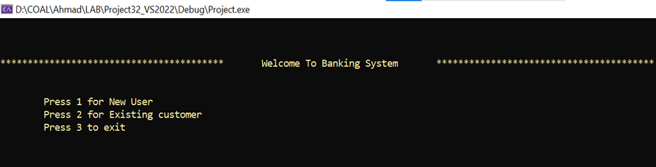

BANKING MANAGEMENT SYSTEM
=========================

The Banking Management System is a console-based application developed using x86 Assembly Language with the Irvine32 library. It simulates essential banking operations such as user registration, login authentication, deposits, withdrawals, and balance inquiries.

Built with a focus on low-level programming fundamentals and file handling techniques, the system demonstrates how core banking features can be implemented securely and efficiently in assembly language. It showcases structured programming, file I/O operations, and user interface logic at the hardware-near level.

📌 FEATURES
-----------
1. **User Authentication**
   - New users can register with a unique username and password.
   - Existing users can log in securely.

2. **Account Transactions**
   - Deposit money.
   - Withdraw money (if balance is sufficient).
   - Check account balance.
   - View account details.
   - Exit the system.

3. **File Handling**
   - User File
   - Money File
   - Password File

🛠 CODE STRUCTURE
------------------
- `.data` Section:
  - Holds constants, messages, and filenames.

- `main PROC`:
  - Displays welcome screen and main menu.
  - Handles user interaction for new or existing customers.

- File Operations:
  - Open/close files for input/output.
  - Read/write data to files.

🎯 OBJECTIVE
------------
Provide a basic yet functional system to simulate banking operations with a secure and user-friendly console interface.

📚 TECHNOLOGY USED
------------------
- Language: Assembly Language (x86)
- Library: Irvine32

📄 DOCUMENTATION
----------------
- Developed as part of the BSCS-5th Semester Assembly Language Course.
- Authors: Ahmad Razzaq

ScreenShots
------------

